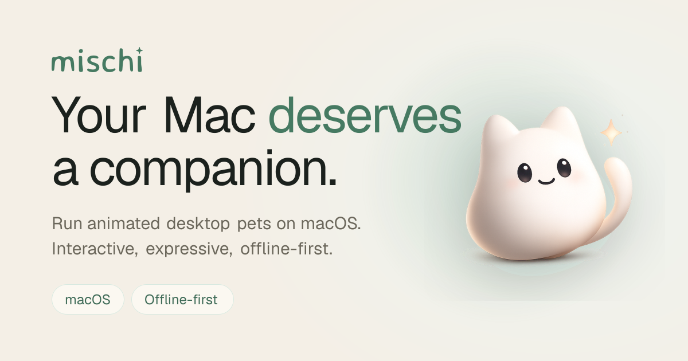

<p align="center">
  
</p>

<h1 align="center">Mischi</h1>

<p align="center">
  The marketing site for <strong>Mischi</strong>, animated desktop pets for macOS.<br/>
  Alive, interactive, offline-first.
</p>

<p align="center">
  <a href="https://mischi.app"><strong>mischi.app</strong></a>
</p>

---

## What's here

This repo is the Mischi landing page, built with the Next.js App Router. It covers
the hero, how-it-works, a looping-video feature showcase, FAQ, legal pages, and an
opt-in waitlist backed by a small server route.

- **Next.js (App Router)** + TypeScript
- **Tailwind v4** with a hand-tuned design-token system (warm paper + sage)
- Lazy, poster-backed `<video>` feature clips and a draggable desktop pet
- Dynamic OG image, sitemap, robots, web manifest, and JSON-LD
- On-load and scroll-reveal animations that respect `prefers-reduced-motion`

## Getting started

```bash
npm install
npm run dev
```

Open [http://localhost:3000](http://localhost:3000).

> Local secrets (for the waitlist) live in `.env.local`. See `.env.example` for the keys.

## Waitlist

The "Join the waitlist" form posts to `app/api/waitlist/route.ts`, which keeps the
provider keys server-side and forwards signups to Kit (ConvertKit). Full setup,
environment variables, deployment, and troubleshooting live in
**[WAITLIST_SETUP.md](./WAITLIST_SETUP.md)**.

## Project structure

```text
app/
  components/        UI sections (hero, features, faq, footer, …)
  api/waitlist/      server route for waitlist signups
  privacy/, terms/   legal pages
  opengraph-image    dynamic social card
  globals.css        design tokens + base styles
lib/seo.ts           site metadata + config
public/features/     feature recordings (mp4 + poster)
docs/og.png          social-card snapshot (used in this README)
```

## Deploying

Deploys to [Vercel](https://vercel.com). Add the waitlist environment variables
under **Project → Settings → Environment Variables** (none are `NEXT_PUBLIC_`, so
they stay server-side), then ship.

---

<p align="center"><sub>Built with care for a tiny desktop companion with an opinion.</sub></p>
