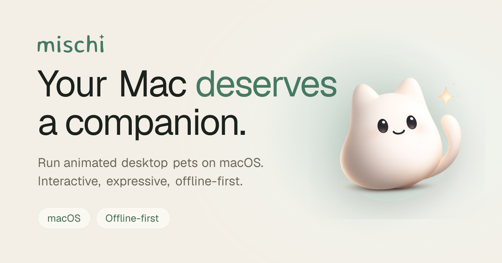

<p align="center">
  
</p>

<h1 align="center">Mischi</h1>

<p align="center">
  The marketing site for <strong>Mischi</strong>, animated desktop pets for macOS.<br/>
  Alive, interactive, offline-first.
</p>

<p align="center">
  <a href="https://mischi.app"><strong>mischi.app</strong></a>
</p>

---

## What's here

This repo is the Mischi website, built with the Next.js App Router. It covers the
hero, how-it-works, a looping-video feature showcase, the download section, FAQ,
newsletter signup, docs, a contact page, and legal pages.

- **Next.js (App Router)** + TypeScript
- **Tailwind v4** with a hand-tuned design-token system (warm paper + sage)
- Lazy, poster-backed `<video>` feature clips and a draggable desktop pet
- Dynamic OG image, sitemap, robots, web manifest, and JSON-LD
- On-load and scroll-reveal animations that respect `prefers-reduced-motion`

## Getting started

```bash
npm install
npm run dev
```

Open [http://localhost:3000](http://localhost:3000).

> Local secrets (for the newsletter and contact form) live in `.env.local`. See `.env.example` for the keys.

## Shipping a new app version

1. Build the notarised DMG in the app repo (`./build.sh --release-dmg`).
2. Copy it into `public/downloads/`.
3. Update `lib/release.ts`: version, date, file name, size and SHA-256
   (`shasum -a 256 Mischi-x.y.z.dmg`).

The hero, nav, download section, docs, footer and JSON-LD all read from `lib/release.ts`.

## Contact page

`/contact` is where the app's **Preferences → About → Report it** button lands. The app
appends `?v=<version>&os=<macOS build>`, which the form attaches to the report.

The form posts to `app/api/contact/route.ts`, which validates the message (honeypot,
same-origin check, per-IP rate limit) and sends it through [Resend](https://resend.com)
to `CONTACT_EMAIL`, with the sender as Reply-To. It needs:

- `RESEND_API_KEY`
- `CONTACT_FROM_EMAIL`: a sender on a domain verified in Resend, e.g. `Mischi <contact@mail.mischi.app>`
- `CONTACT_TO_EMAIL` (optional): defaults to `CONTACT_EMAIL` in `lib/release.ts`

If sending fails, the form offers the same message as a pre-filled email instead.

## Analytics

Cookieless [PostHog](https://posthog.com) counts pageviews and a few named events. It
stays off until `NEXT_PUBLIC_POSTHOG_PROJECT_TOKEN` is set, and never loads for
visitors who send Do Not Track or Global Privacy Control.

- `instrumentation-client.ts` starts PostHog (memory persistence, no autocapture,
  no session recording).
- `lib/analytics.ts` classifies link clicks by destination (`download_clicked`,
  `docs_link_clicked`, `outbound_link_clicked`, …) and exports `track()` for the
  form events (`newsletter_subscribed`, `contact_message_sent`,
  `docs_search_result_opened`).
- Events go through `/relay/*` on our own domain (rewrites in `next.config.ts`).
  Set `NEXT_PUBLIC_POSTHOG_REGION=us` if the PostHog project is in the US region.

Never add personal data (emails, names, message text) to event properties; the
privacy policy promises it isn't collected.

## Newsletter

The newsletter form posts to `app/api/subscribe/route.ts`, which keeps the provider
keys server-side and forwards signups to Kit (`KIT_API_KEY`, `KIT_FORM_ID`) and/or a
Google Sheet (`NEWSLETTER_SHEET_ENDPOINT`, or the older `WAITLIST_SHEET_ENDPOINT`).
A signup is accepted if at least one backend takes it.

## Project structure

```text
app/
  components/        UI sections (hero, download, newsletter, faq, footer, …)
  api/subscribe/     server route for newsletter signups
  docs/              user guide: install, settings, AI, creating pets
  contact/           bug reports and questions (linked from the app)
  privacy/, terms/   legal pages
  opengraph-image    dynamic social card
  globals.css        design tokens + base styles
lib/release.ts       current app version + download details
lib/seo.ts           site metadata + config
public/downloads/    notarised DMGs
public/features/     feature recordings (mp4 + poster)
docs/og.png          social-card snapshot (used in this README)
```

## Deploying

Deploys to [Vercel](https://vercel.com). Add the newsletter and contact environment variables
under **Project → Settings → Environment Variables** (none are `NEXT_PUBLIC_`, so
they stay server-side), then ship.

---

<p align="center"><sub>Built with care for a tiny desktop companion with an opinion.</sub></p>
